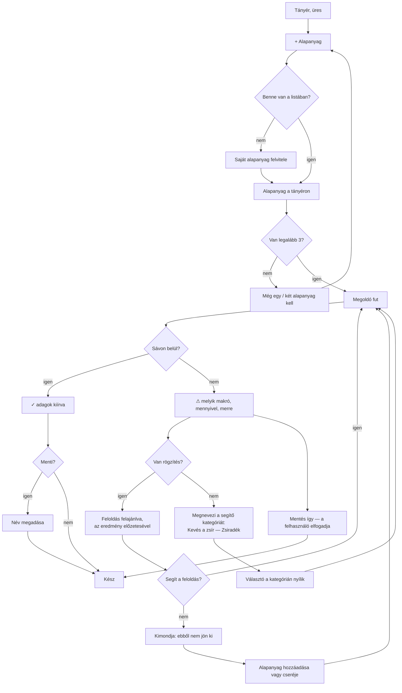
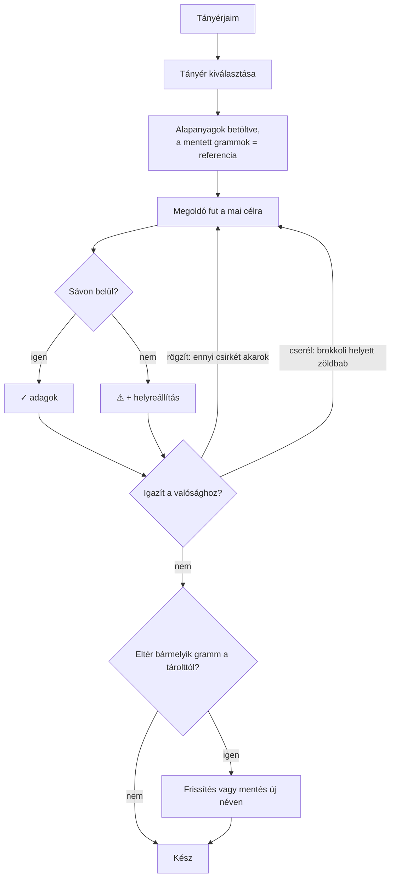
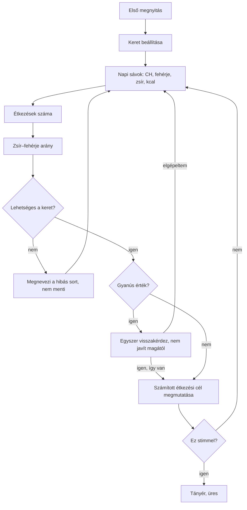

# Ketara — Folyamatok és képernyők v0.6

*Kísérőanyag a PRD v0.9-hez. Minden döntés onnan származik.*
*Utolsó frissítés: 2026-09-27*

---

## Kiindulás

Négy dolog rögzíti ezt a tervet:

1. **Az étkezési cél állandó** (napi sáv ÷ étkezésszám, minden étkezésre azonos
   zsír–fehérje aránnyal). Nincs étkezésválasztó.
2. **A megoldó a referenciatányérhoz keresi a legközelebbi megoldást** (relatív
   eltérésben); ha nincs korábbi használat, az alapanyag egyedi felülírásához, végül a
   kategória alapértékéhez.
3. **A ⚠ állapot gyakoribb lesz, mint a ✓.** Rögzítéssel különösen. Ez tehát nem
   hibaképernyő, hanem a termék fő állapota.

4. **A grammok nem ismétlődnek, csak a készlet.** A megoldó minden étkezésnél lefut.
   A **Tányér a főképernyő**; a Tányérjaim nem előzmény, hanem **kiindulópont-tár**.
   Egy mentett tányér megnyitása nem olvasás, hanem újraszámolás.

---

## 1. Folyamat — Új tányér összeállítása

Ez a termék fő útja. Ott áll a konyhában, előtte van, ami van.



**A `Mentés így` ág nem opcionális.** Ő dönti el, mit eszik meg, nem a szoftver. Ha
elfogadja a 6,6 g túllépést, az app nem áll az útjába — csak egyszer, világosan megmondja,
mi a helyzet.

---

## 2. Folyamat — Ismétlődő étkezés



**A megoldó itt is lefut.** A mentett tányér nem kész válasz — a grammok soha nem
ismétlődnek pontosan, mert a valóság minden nap más. A tárolt mennyiségek csak azt mondják
meg a megoldónak, milyen arányt szeret.

Ez egyben megoldja a korábbi „elavult mentett tányér" veszélyt is: mivel minden megnyitás
újraszámol, egy javított keret (elgépelés) vagy módosított tápérték automatikusan átüt a
régi tányérokon. Külön ellenőrzés nem kell.

---

## 3. Folyamat — Első indítás



A `H` lépés a legfontosabb az egész beállításban: **mutasd meg neki a kiszámolt étkezési
célt, mielőtt továbbenged.** Négy éve fejből tudja, mennyi jön ki egy étkezésre. Ha a mi
számunk más, azonnal látja, és rögtön kiderül, hogy félreértettük a papírt.

---

## 4. Képernyőlista

| # | Képernyő | Egy mondatban |
|---|---|---|
| 1 | **Tányér** | Itt történik minden: alapanyagok, adagok, eredmény, egy képernyőn. |
| 2 | **Alapanyag-választó** | Alsó lap: keresés, kategóriák, legutóbbiak. |
| 3 | **Saját alapanyag** | Név, kategória, 100 g tápérték. |
| 4 | **Tányérjaim** | Kiindulópontok: mentett alapanyag-kombinációk, megnyitáskor újraszámolva. |
| 5 | **Keret** | A dietetikus számai, és a belőlük számolt étkezési cél. |

Öt képernyő. Ha ennél több lesz, valamit rosszul csinálunk.

---

## 5. Tányér — a fő képernyő állapotai

### 5.1 Üres

```
┌─ Tányér ─────────────────────────┐
│ Étkezési cél                  ⚙ │
│ CH 5–10 · Fe 20–25 · Zs 45–70   │
│ ──────────────────────────────── │
│                                  │
│   Még nincs alapanyag.           │
│   Válassz legalább hármat,       │
│   és kiszámolom az adagokat.     │
│                                  │
│                                  │
│ [ + Alapanyag                  ] │
│ [ Tányérjaim                   ] │
└──────────────────────────────────┘
```

### 5.2 Alulhatározott (1–2 alapanyag)

```
┌─ Tányér ─────────────────────────┐
│ CH 5–10 · Fe 20–25 · Zs 45–70   │
│ ──────────────────────────────── │
│ Tojás                   — g      │
│ Brokkoli                — g      │
│                                  │
│ [ + Alapanyag ]                  │
│ ──────────────────────────────── │
│ Még egy alapanyag kell a         │
│ számoláshoz.                     │
└──────────────────────────────────┘
```

A `— g` fontos: **a sorok már ott vannak, csak a szám hiányzik.** Így látszik, hogy nem
elromlott valami, hanem még nincs kész.

### 5.3 Sávon belül

```
┌─ Tányér ─────────────────────────┐
│ CH 5–10 · Fe 20–25 · Zs 45–70   │
│ ──────────────────────────────── │
│ Tojás         137 g nyersen   📌 │
│ Brokkoli      100 g nyersen   📌 │
│ Olaj           31 g nyersen   📌 │
│                                  │
│ [ + Alapanyag ]                  │
│ ──────────────────────────────── │
│ ✓ Minden érték a sávon belül.    │
│                                  │
│ [ Tányér mentése               ] │
└──────────────────────────────────┘
```

Ha a Keretben van kcal-sáv, és a makrók szerinti megoldás abból kilóg, a ✓ alatt egy sor
jelenik meg: *„Kalória: 40 kcal-lal a sáv fölött."* Az állapot ✓ marad.

**Mentett tányérból indulva** a mentés helyén két gomb áll, ha az eredmény eltér a
tároltaktól:

```
│ ✓ Minden érték a sávon belül.    │
│                                  │
│ [ Csütörtöki csirkés frissítése ]│
│ [ Mentés új néven              ] │
```

A két gomb akkor jelenik meg, ha **bármelyik kiírt gramm** eltér a tárolttól. A horgony így
csak akkor mozdul, ha ő mozdítja. Nem sodródik el csendben, és nem is ragad be véglegesen
egy elavult arányba.

A 📌 minden soron ott van, halványan — ez a rögzítés gombja. Nem külön menüben,
nem hosszú nyomásra: **látható és egy koppintás.** Ez a funkció, amit ő maga kért.

**Soron belüli műveletek** (koppintás a néven): `Rögzítés` · `Csere` · `Törlés`.
A csere ugyanannak a kategóriának a tagjait kínálja, és **leveszi a rögzítést** —
180 g brokkolit rögzíteni nem ugyanaz, mint 180 g zöldbabot.

```
┌─ Csere: Brokkoli ────────── ✕ ──┐
│ Zöldség                          │
│  Zöldbab · Karfiol · Cukkini     │
│  Spenót · Paprika · Sárgarépa    │
│ ──────────────────────────────── │
│ [ Másik kategóriából…          ] │
└──────────────────────────────────┘
```

### 5.4 Legközelebbi elérhető (⚠) — rögzítés az ok

```
┌─ Tányér ─────────────────────────┐
│ CH 5–10 · Fe 20–25 · Zs 45–70   │
│ ──────────────────────────────── │
│ Tojás         240 g nyersen   📍 │
│ Brokkoli       48 g nyersen   📌 │
│ Olaj           39 g nyersen   📌 │
│                                  │
│ [ + Alapanyag ]                  │
│ ──────────────────────────────── │
│ ⚠ Fehérje: 6,6 g-mal a sáv       │
│ fölött.                          │
│                                  │
│ A rögzített 240 g tojás önmagában│
│ 30,2 g fehérjét hoz. A sáv teteje│
│ 25 g.                            │
│                                  │
│ Ha feloldod a tojást:            │
│ 137 g tojás · 100 g brokkoli ·   │
│ 31 g olaj (nyersen) → minden     │
│ érték a sávon belül.             │
│                                  │
│ [ Tojás feloldása ]  [+ Alapanyag]│
│ [ Mentés így                    ] │
└──────────────────────────────────┘
```

Három dolog, ami itt szándékos:

- **A 📍 (rögzített) más, mint a 📌 (rögzíthető).** Ránézésre látszik, mi fix.
- **Az előzetes megmondja, hová vezet a feloldás** — itt a sávba; ha az sem elég, azt
  mondja ki. Enélkül a felhasználó vaktában
  nyomkod, és pontosan azt csinálja, amit ma is: próbálgat 10 percig.
- **A `Mentés így` ott van.** Nem rejtjük el, nem kérdezünk rá kétszer.
- **A brokkoli 48 g-ra csökken.** A megoldó ⚠ esetén előbb a kilógást csökkenti: a
  brokkoli is hoz fehérjét, ezért addig megy le, amíg a CH-sáv alja engedi. Az olaj annyi,
  amennyit az arány kér.

### 5.5 Minden alapanyag rögzítve

```
│ Tojás         160 g nyersen   📍 │
│ Brokkoli      150 g nyersen   📍 │
│ Olaj           20 g nyersen   📍 │
│ ──────────────────────────────── │
│ Nincs mit kiszámolni — minden    │
│ adag rögzítve.                   │
│ CH 11,6 g (sáv fölött)           │
│ Fe 24,4 g ✓                      │
│ Zs 36,6 g (sáv alatt)            │
│ Arány 1,5 : 1 (minimum 2 : 1)    │
│                                  │
│ Ha feloldod az olajat:           │
│ 33 g olaj (nyersen) → CH 1,6 g-  │
│ mal a sáv fölött.                │
│                                  │
│ [ Olaj feloldása ]               │
│ [ Rögzítések feloldása         ] │
```

Ez nem hibaállapot: **kiértékelés.** „Ezt akarom enni — jó lesz?" Legitim kérdés, és a
termék válaszol rá.

**Melyik feloldást ajánlja:** a megoldó egyenként kipróbálja mindhárom feloldást. Egyik sem
hoz sávba (a tojás vagy a brokkoli feloldása a CH-t nem viszi le eléggé, vagy a zsír marad
alatta), az olajé csökkenti a legjobban a kilógást (csak a CH marad 1,6 g-mal fölötte).
Ezért kerül mellé a „Rögzítések feloldása" is — az csak akkor jelenik meg, ha egyetlen
feloldás sem elég. Ha valamelyik egyedül sávba hozna, csak az az egy gomb állna ott.

---

## 6. A többi képernyő

### 6.1 Alapanyag-választó (alsó lap)

```
┌─ Alapanyag ──────────────── ✕ ──┐
│ [🔍 keresés                    ] │
│ ──────────────────────────────── │
│ Legutóbb használt                │
│  Csirkemell · Tojás · Brokkoli   │
│  Cukkini · Olívaolaj · Vaj       │
│ ──────────────────────────────── │
│ Fehérjeforrás      >             │
│ Gabonaköret        >             │
│ Zöldség            >             │
│ Zsiradék           >             │
│ Gyümölcs           >             │
│ Tejtermék          >             │
│ ──────────────────────────────── │
│ [ + Saját alapanyag            ] │
└──────────────────────────────────┘
```

**Állapotok:** üres kereső (legutóbbiak + kategóriák) · találatok · nincs találat.

Nincs találat esetén: *„Nincs ilyen a listában. Felviszed sajátként?"* — és a beírt szöveg
átkerül a névmezőbe. Ne kelljen újra begépelni.

### 6.2 Saját alapanyag

```
┌─ Saját alapanyag ──────── ✕ ────┐
│ Név                              │
│ [ Anyu túrója                  ] │
│                                  │
│ Kategória                        │
│ [ Tejtermék                  ▾ ] │
│                                  │
│ 100 grammban, nyersen            │
│ Szénhidrát  [  4 ] g             │
│ Fehérje     [ 13 ] g             │
│ Zsír        [  1 ] g             │
│                                  │
│ [ Mentés                       ] │
└──────────────────────────────────┘
```

**A kategória kötelező, és ez nem adminisztráció:** ebből jön az alapérték, amihez a
megoldó horgonyoz az első használatnál. Ha nincs kategória, az első javaslat vaktában
születik.

**Ellenőrzés:** CH + fehérje + zsír ≤ 100 g. Ha nem, a szöveg: *„100 grammban ennyi nem
fér el. Nézd meg a csomagolást."* Nem „érvénytelen bevitel".

### 6.3 Tányérjaim

```
┌─ Tányérjaim ─────────────────────┐
│ Csütörtöki csirkés               │
│ csirkemell · cukkini · vaj       │
│                                  │
│ Reggeli túrós                    │
│ túró · dió · tejszín             │
│                                  │
│ Tojásos vacsora                  │
│ tojás · brokkoli · olaj          │
│                                  │
│ [ + Új tányér                  ] │
└──────────────────────────────────┘
```

**Üres állapot — az első nap:**
*„Még nincs mentett tányérod. Számolj ki egyet, és mentsd el — legközelebb innen indulhatsz."*

Ez az üres állapot fontos: **megmondja, mi lesz a jutalom.** A termék az első héten
gyűjt, utána fizet.

**Megnyitáskor:** a tányér nem kész számokkal nyílik meg, hanem betölti az alapanyagokat,
és **újraszámol**. A mentett grammok a horgony, nem a válasz. Ha a felhasználó ezt nem
látja, azt fogja hinni, hogy elromlott valami — ezért a fejlécben egy sor:
*„{Tányér neve} — a mai célra újraszámolva."*

### 6.4 Keret

```
┌─ Keret ──────────────────────────┐
│ Napi sávok                       │
│ Szénhidrát  [ 15]–[ 30] g        │
│ Fehérje     [ 60]–[ 75] g        │
│ Zsír        [135]–[210] g        │
│ Kalória     [    ]–[    ] kcal   │
│                                  │
│ Étkezések száma      [ 3 ]       │
│ Zsír : fehérje, min. [ 2 ] : 1   │
│ ──────────────────────────────── │
│ Egy étkezésre ez jön ki:         │
│ CH 5–10 · Fe 20–25 · Zs 45–70    │
│                                  │
│ [ Mentés                       ] │
└──────────────────────────────────┘
```

Az alsó blokk a lényeg. **Nem beviteli mező, hanem visszajelzés** — ő négy éve tudja
fejből, mennyi jön ki egy étkezésre, és itt azonnal látja, hogy jól értettük-e a papírt.

Az arány mezőben csak a zsír oldala írható, alapértéke 2. Minden szöveg ezt az értéket
írja ki.

**Lehetetlen keret:** ha egy alsó határ nagyobb a felsőnél, vagy a zsírsáv teteje kisebb,
mint {min} × a fehérjesáv alja, a termék nem menti, és megnevezi a sort: *„A zsírsáv teteje
kisebb, mint amit az arány a fehérjéhez kér. Így egyetlen tányér sem jönne ki."*

**Gyanús érték:** a termék nem javítja csendben, és nem is tiltja meg. Visszakérdez
egyszer — alacsony értéknél: *„Ez alacsonyabb, mint amit dietetikusok általában adnak.
Biztosan így van a papíron?"*; szűk sávnál: *„Ez a sáv nagyon szűk, kevés tányér fog
beleférni. Biztosan így van a papíron?"* — és ha igen, elfogadja. A küszöbök (napi 1200 kcal,
napi 50 g fehérje, a sáv alsó határának 10%-a) helykitöltők, a dietetikus erősíti meg őket.
Nem a mi dolgunk felülbírálni a dietetikust; a mi dolgunk észrevenni az elgépelést.

---

## 7. Szövegek egy helyen

| Hol | Szöveg |
|---|---|
| Tányér, üres | Még nincs alapanyag. Válassz legalább hármat, és kiszámolom az adagokat. |
| Tányér, 2 alapanyag | Még egy alapanyag kell a számoláshoz. |
| Tányér, 1 alapanyag | Még két alapanyag kell a számoláshoz. |
| ✓ | Minden érték a sávon belül. |
| ✓ + kcal | Kalória: {n} kcal-lal a sáv {fölött / alatt}. |
| ⚠ általános | {Makró}: {n,n} g-mal a sáv {fölött / alatt}. |
| ⚠ rögzítés az ok, felső él | A rögzített {n} g {alapanyag} önmagában {m,m} g {makrót} hoz. A sáv teteje {k} g. |
| ⚠ rögzítés az ok, alsó él | A rögzített {n} g {alapanyag} mellett a {makró} legfeljebb {m,m} g lehet. A sáv alja {k} g. |
| ⚠ feloldás-előzetes, sikeres | Ha feloldod a {alapanyagot}: {adagok} → minden érték a sávon belül. |
| ⚠ feloldás-előzetes, részleges | Ha feloldod a {alapanyagot}: {adagok} → {makró} {n,n} g-mal a sáv {fölött / alatt}. |
| ⚠ arány | Zsír–fehérje arány: {x,x} : 1, a minimum {min} : 1. |
| ⚠ 0 g | A {alapanyag} 0 g-ra szorult — nélküle jönne ki. Cseréld vagy vedd ki. |
| ⚠ nincs rögzítés, kevés | Kevés a {makró} — adj hozzá a {kategória} közül. |
| ⚠ nincs rögzítés, sok | Sok a {makró} — cseréld a {alapanyagot} egy másik {kategória}-félére. |
| ⚠ zsákutca | Ebből a {n} alapanyagból nem jön ki. |
| Több rögzítés, egyik feloldás sem elég | Rögzítések feloldása |
| Minden rögzítve | Nincs mit kiszámolni — minden adag rögzítve. |
| Nincs keresési találat | Nincs ilyen a listában. Felviszed sajátként? |
| Érvénytelen tápérték | 100 grammban ennyi nem fér el. Nézd meg a csomagolást. |
| Tányérjaim, üres | Még nincs mentett tányérod. Számolj ki egyet, és mentsd el — legközelebb innen indulhatsz. |
| Mentett tányér megnyitva | {Tányér neve} — a mai célra újraszámolva. |
| Frissítés gomb | {Tányér neve} frissítése |
| Frissítés után | Frissítve. Legközelebb innen indul. |
| Csere rögzített soron | A rögzítés lekerült, mert az alapanyag változott. |
| Keret, gyanúsan alacsony | Ez alacsonyabb, mint amit dietetikusok általában adnak. Biztosan így van a papíron? |
| Keret, gyanúsan szűk | Ez a sáv nagyon szűk, kevés tányér fog beleférni. Biztosan így van a papíron? |
| Keret, lehetetlen (alsó > felső) | Az alsó határ nagyobb a felsőnél. Nézd meg a papírt. |
| Keret, lehetetlen (arány) | A zsírsáv teteje kisebb, mint amit az arány a fehérjéhez kér. Így egyetlen tányér sem jönne ki. |


Minden szöveg tegező, kijelentő, és **megmondja a következő lépést.** Nincs „Hiba
történt", nincs „Érvénytelen".

---

## 8. Amit ez a terv még nem old meg

- **Napközbeni eltérés** — ha egy étkezésnél kilépett a sávból, a következőnél ezt nem
  tudja beszámítani. Tudatos: a napkövetés out of scope.
